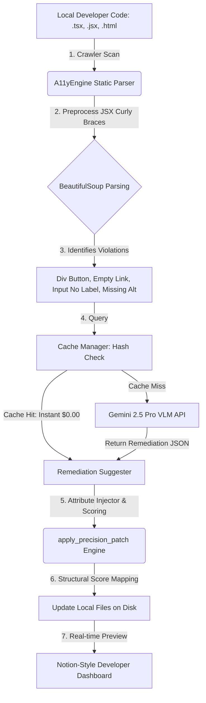

# 🛡️ A11y-Agent: Autonomous WCAG Remediation & AST Patching Workspace

[](https://reactjs.org/)
[](https://fastapi.tiangolo.com/)
[](https://ai.google.dev/)
[](https://www.typescriptlang.org/)
[](https://opensource.org/licenses/MIT)

> **Bridge the digital inclusion gap for AI-generated UIs.** A11y-Agent is a post-processor workspace that scans local developer frontends (JSX, TSX, HTML), identifies WCAG accessibility regressions, calls Google's Gemini models for semantic remediations, and safely modifies files on disk using a custom structural AST-like precision patch engine.

---

## 💡 The Problem & The Mission

AI coding tools like **v0.dev, Bolt.new, Lovable, and Claude Engineer** have revolutionized development speeds. However, they routinely output frontends with severe accessibility (WCAG) regressions:
* ⚠️ **Div Buttons:** Clickable non-interactive tags like `div` or `span` that are completely hidden from keyboard focus and screen readers.
* ⚠️ **Unlabelled SVG Icons:** Action buttons containing only graphical vectors with zero audio descriptors.
* ⚠️ **Disconnected Controls:** Form input fields lacking associated `<label>` references or fallback `aria-label` tags.
* ⚠️ **Missing Graphics Alt:** Imagery devoid of descriptive `alt` tags.

**A11y-Agent** solves this by automating the audit-fix cycle. It processes local workspace files, simulates a complete virtual browser/keyboard focus ring context, calls Gemini to write the ideal semantic corrections, and structural patches files directly in your environment.

---

## 🛠️ System Architecture



---

## 🔥 Key Technical Highlights

### 1. Multi-Format Preprocessor Engine
Rather than relying on standard DOM parsers which crash on React's curly brace attributes (`src={profilePic}`) and JSX event bindings (`onClick={handleClick}`), A11y-Agent features a custom regex preprocessor. It normalizes JSX files into standard-compliant structures so tree parsing can run on React, HTML, and Vue files identically.

### 2. AST-Based Precision Structural Patching
Modifying files with regular expressions is highly fragile. A11y-Agent deploys a **scoring matching algorithm** (`apply_precision_patch`):
* Extracts tags, classes, and IDs from target nodes.
* Climbs the local workspace code to search for structural similarity.
* Injects React-compatible props (like camelCase `tabIndex` and keyboard listener functions) without breaking existing styling rules, changing code formatting, or double-injecting parameters.

### 3. Context-Aware AI Remediations (with Gemini)
Rather than hardcoding static fixes, the app feeds the exact violating element and surrounding markup parent hierarchy to **Gemini**. Gemini reasons about the visual/functional intent of the UI to:
* Generate context-aware image descriptions (e.g., distinguishing an avatar image from a vector chart).
* Design robust keyboard listener methods (e.g., adding `onKeyDown` with key matches for `"Enter"` and `" "` to clickable containers).
* Infer correct inputs (e.g., labeling search fields based on placeholder metrics).

### 4. Smart De-duplication Cache (Real-time Analytics)
To prevent API overhead and maximize speed, a dedicated `CacheManager` caches hashes of scanned code. It features a built-in analytics dashboard showing **Total Hits**, **Misses**, and **Total USD Saved** by skipping repeated AI calls.

### 5. Premium Notion-Style UI Dashboard
Built using premium visual aesthetics, our client dashboard runs a customized sidebar environment:
* **Interactive Workspace:** Step-by-step audit tabs displaying initial vs. patched compliance scores (0-100%).
* **Live Line-by-Line Code Diff:** Visually inspect exact code additions green (+) and removals red (-) before approving changes.
* **One-Click Batch Remediation:** Patches all workspace components simultaneously and saves them straight back to your computer.
* **Compliance Report Downloader:** Generates professional Markdown Audit summaries for product managers and compliance officers.

---

## ⚡ Visual Code Remediation: Before & After

### Case Study: Clickable Div Button (WCAG 2.1.1 & 4.1.2)

#### ❌ Non-Compliant Source Code:
```tsx
import React from 'react';

export default function LandingPage() {
    const saveChanges = () => alert("Saved changes!");
    
    return (
        <div onClick={saveChanges} className="btn-style">
            Save Changes
        </div>
    );
}
```

#### ✅ Remediated Code (Autonomously Patched):
```tsx
import React from 'react';

export default function LandingPage() {
    const saveChanges = () => alert("Saved changes!");
    
    return (
        <div onClick={saveChanges} className="btn-style" role="button" tabIndex={0} onKeyDown={(e) => { if (e.key === "Enter" || e.key === " ") { e.preventDefault(); e.currentTarget.click(); } }}>
            Save Changes
        </div>
    );
}
```
*Benefits:* The `div` is placed in the keyboard tab cycle, has a button semantic announcer for screen readers, and is triggerable using standard Space/Enter keyboard clicks.

---

## ⚙️ Setup & Local Installation

### 1. Prerequisites
* Python 3.10+
* Node.js v18+
* Google Gemini API Key (Get one from [Google AI Studio](https://aistudio.google.com/))

### 2. Backend Installation (FastAPI)
```bash
cd backend
python -m venv venv
source venv/bin/activate  # On Windows: venv\Scripts\activate
pip install -r requirements.txt
```

Create a `.env` file inside the `backend` folder:
```env
GEMINI_API_KEY=your_gemini_api_key_here
GEMINI_MODEL=gemini-2.5-pro
```

Start the core service:
```bash
python main.py
```
*The server will boot on [http://localhost:8000](http://localhost:8000)*

### 3. Frontend Installation (Vite + TypeScript)
```bash
cd ../frontend
npm install
npm run dev
```
*The UI will open on [http://localhost:5173](http://localhost:5173)*

---

## 💡 Future Roadmap & Scaling
- [ ] **Visual Contrast Analyzer:** Leverage Gemini Multimodal Vision capabilities to take dashboard screenshots and flag color contrast (WCAG 1.4.3) infractions.
- [ ] **GitHub App Webhook:** Turn the workflow agent into a direct GitHub App bot that automatically audits PR code and provides inline suggestions on new code commits.
- [ ] **AST-Babel Transformer Integration:** Move from tag-based precision string patching to deep JS/TS AST structural rewriting using Babel for absolute preservation of complex JSX formatting.

---

## 📄 License
This project is licensed under the MIT License - see the [LICENSE](LICENSE) file for details.

*Developed with 🛡️ by a developer fighting for digital accessibility for all.*
